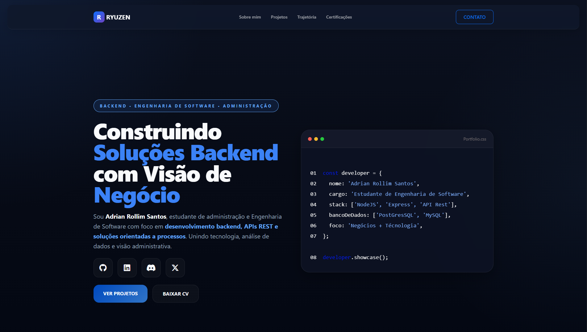

<div align="center">


# Adrian Rollim Santos

**Backend Developer | Engenharia de Software & Administração**

`Varginha, MG - Brasil`

<br>

[](https://portifolio.ryuzen.ink)

<a href="https://www.ryuzen.ink">
  
</a>

<br>

<a href="https://www.linkedin.com/">
  
</a>

<a href="https://github.com/ryuzenink-cell">
  
</a>

<a href="mailto:adrianrollimsantos@yahoo.com">
  
</a>


</div>

<br>

## Sobre mim

Estudante de **Engenharia de Software** com base em lógica de programação, APIs REST e desenvolvimento backend.  
Também curso **Administração**, o que fortalece minha visão analítica sobre processos, dados e negócios.

Busco oportunidades de estágio e crescimento profissional na área de tecnologia, principalmente em desenvolvimento backend, automação de processos e soluções orientadas a negócio.

```yaml
nome: Adrian Rollim Santos
cargo: Desenvolvedor Backend em Formação
localizacao: Varginha-MG, Brasil
foco:
  - Backend Development
  - APIs REST
  - Node.js & Express
  - Negócio + Tecnologia
objetivo: Estágio em Tecnologia
status: Disponível para oportunidades
```

<br>

## Tech Stack

<div align="center">

<table>
<tr>
<td align="center" width="33%">

**Backend**


</td>

<td align="center" width="33%">

**Banco de Dados**


</td>

<td align="center" width="33%">

**Ferramentas**


</td>
</tr>

<tr>
<td align="center" colspan="3">

**Linguagens Conhecidas**


</td>
</tr>
</table>

</div>

<br>

## Projetos

<div align="center">
<em>Projetos focados em backend, APIs e soluções práticas</em>
</div>

<br>

### API de Controle de Fluxo de Caixa

Projeto backend para registro e gerenciamento de transações financeiras com:

- operações CRUD
- rotas HTTP com Node.js + Express
- validação de dados
- regras de negócio para entradas e saídas financeiras

**Tecnologias:** JavaScript, Node.js, Express, API REST

🔗 Repositório:  
https://github.com/ryuzenink-cell/construction-cashflow-api

<br>

## Experiência Profissional

### Drogaria São Paulo (Grupo DPSP)

**Atendente de Loja / Operador de Caixa**  
Jan 2025 – Abr 2026 | Varginha, MG

- Controle e conferência de valores
- Organização de processos operacionais
- Apoio em rotinas administrativas
- Registro e acompanhamento de dados operacionais

Essa experiência fortaleceu minha visão analítica e minha capacidade de trabalhar com processos, organização e consistência de informações.

<br>

## Formação Acadêmica

### Engenharia de Software  
**Universidade Estácio de Sá**  
Jan 2026 – Dez 2031

### Administração  
**Universidade Estácio de Sá**  
Jan 2025 – Dez 2030

A combinação entre tecnologia + gestão é hoje meu principal diferencial profissional.

<br>

## GitHub Stats

<div align="center">


</div>

<br>

<div align="center">


</div>

<br>

<div align="center">


**Construindo soluções backend com visão de negócio.**

</div>

